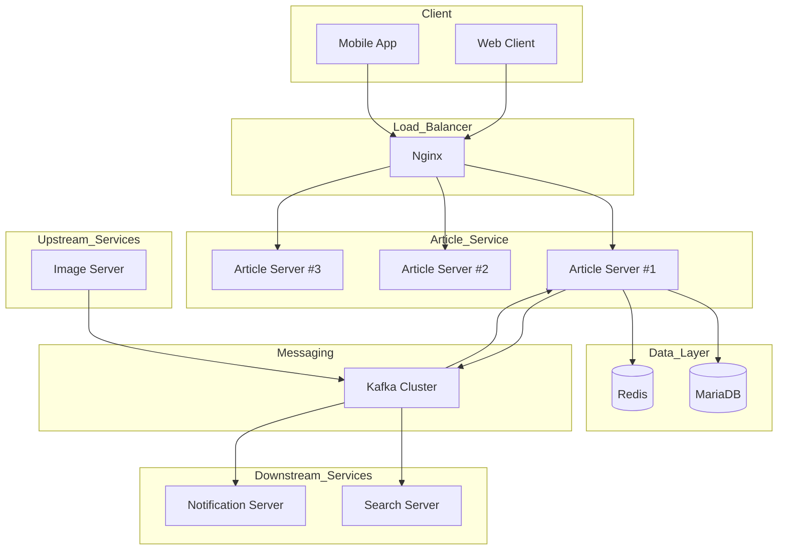
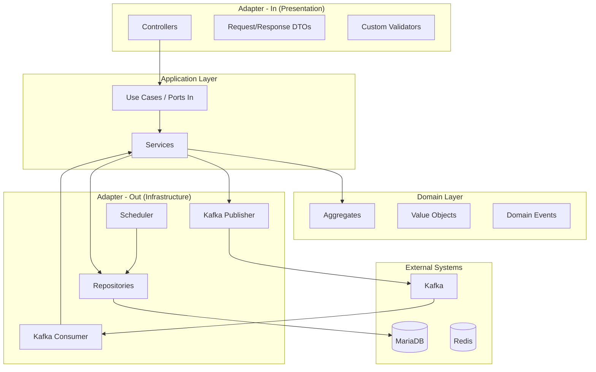
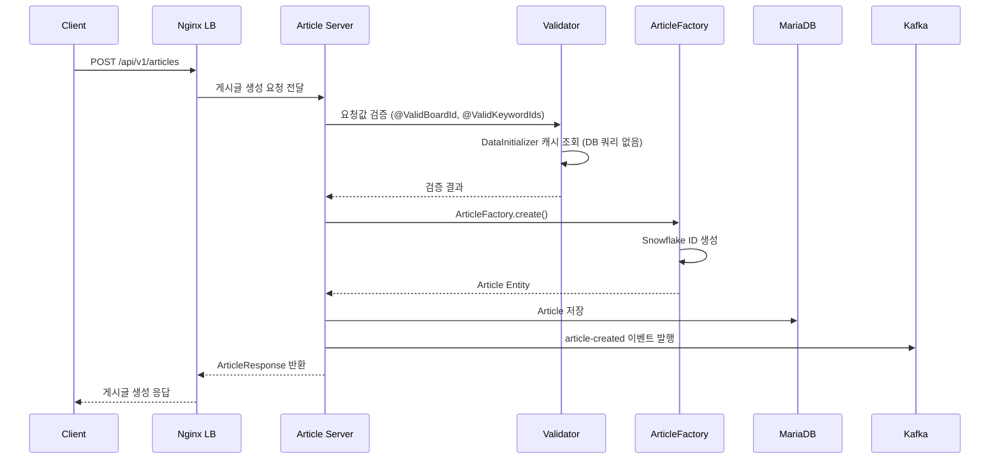
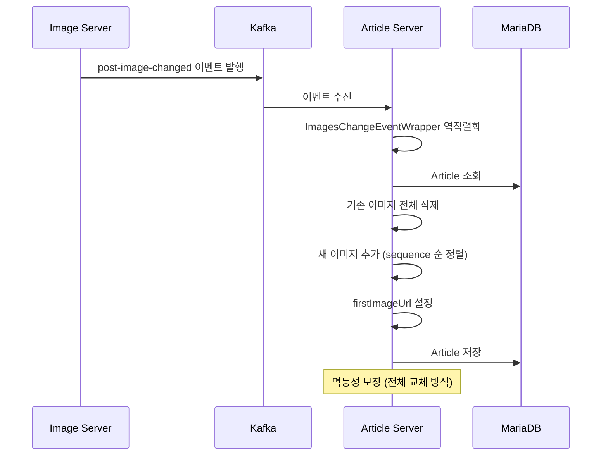
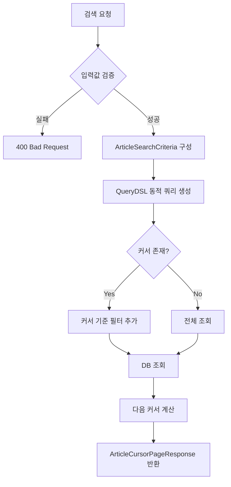
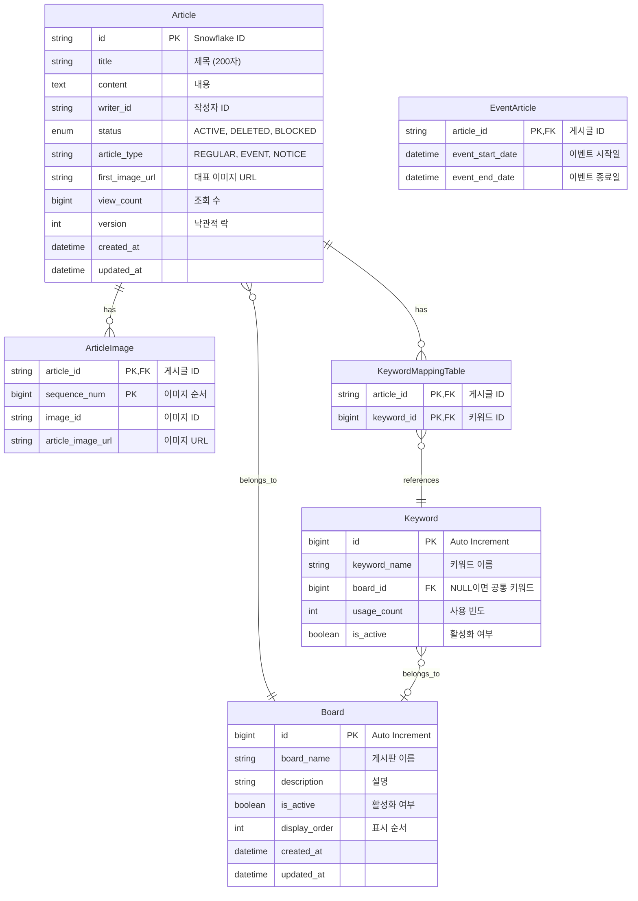
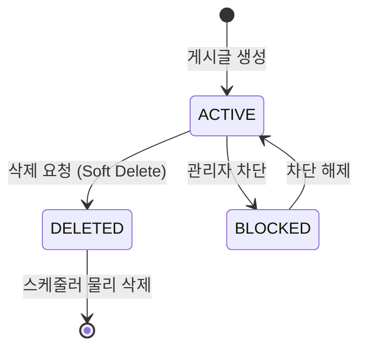
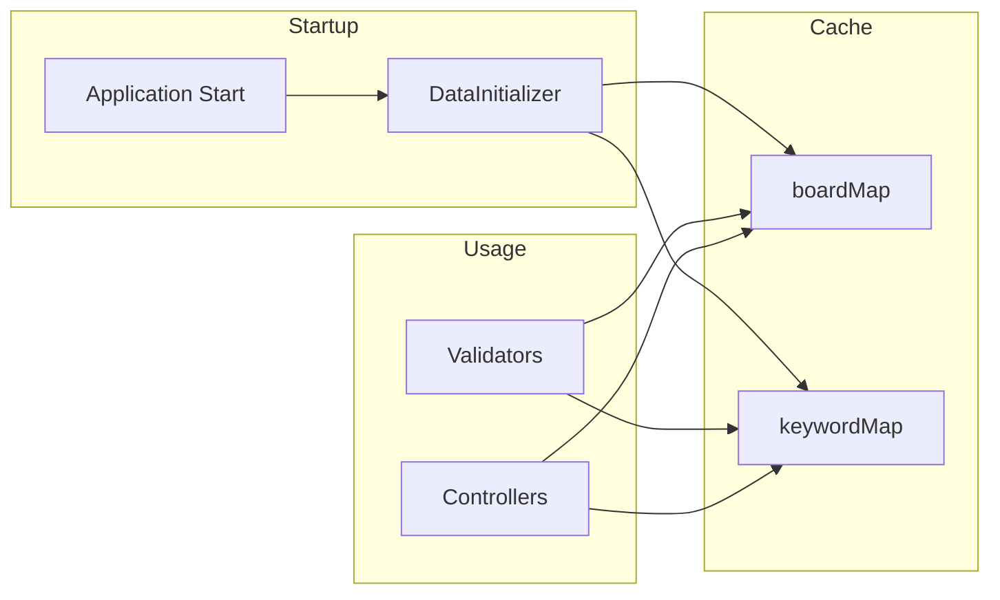

# Article-Server 가이드 문서

## 1. 개요

### 1.1 목적

Article-Server는 플랫폼 내 게시글 라이프사이클을 전담 관리하는 마이크로서비스이다.

### 1.2 주요 기능

| 기능           | 설명                                     |
|--------------|----------------------------------------|
| 게시글 CRUD     | 생성, 조회, 수정, 삭제 (Soft Delete)           |
| 게시글 타입 지원    | Regular, Event, Notice 타입별 관리          |
| 게시판 분류       | Board 기반 게시글 분류 및 필터링                  |
| 키워드 태깅       | 공통/게시판 전용 키워드 지원                       |
| 이미지 연동       | 외부 Image Server와 Kafka 이벤트 기반 동기화      |
| 커서 기반 페이지네이션 | 무한 스크롤 지원, updatedAt + articleId 복합 커서 |
| 벌크 조회        | 다중 게시글 ID 기반 일괄 조회                     |
| 자동 정리        | 삭제된 게시글 정기 물리 삭제                       |

### 1.3 기술 스택

| 구분             | 기술                          |
|----------------|-----------------------------|
| Framework      | Spring Boot 3.5.6           |
| Language       | Java 17                     |
| Database       | MariaDB                     |
| Cache          | Redis                       |
| Message Broker | Apache Kafka                |
| ORM            | Spring Data JPA (Hibernate) |
| Query          | QueryDSL 5.1.0              |
| Scheduler      | ShedLock 5.10.2 (Redis 기반)  |

---

## 2. 시스템 아키텍처

### 2.1 전체 구조



### 2.2 레이어 아키텍처 (Hexagonal Architecture)



### 2.3 게시글 생성 흐름



### 2.4 이미지 변경 이벤트 처리 흐름



### 2.5 게시글 검색 흐름



---

## 3. 데이터 모델

### 3.1 ERD



### 3.2 테이블 상세

#### Article (게시글)

| 필드              | 타입           | 필수 | 설명                       |
|-----------------|--------------|----|--------------------------|
| id              | VARCHAR(50)  | Y  | Snowflake ID             |
| title           | VARCHAR(200) | Y  | 게시글 제목                   |
| contents        | TEXT         | Y  | 게시글 내용                   |
| writer_id       | VARCHAR(50)  | Y  | 작성자 ID                   |
| board_id        | BIGINT       | Y  | FK to Board              |
| status          | ENUM         | Y  | ACTIVE, DELETED, BLOCKED |
| article_type    | VARCHAR(31)  | Y  | REGULAR, EVENT, NOTICE   |
| first_image_url | VARCHAR(500) | N  | 대표 이미지 URL               |
| view_count      | BIGINT       | Y  | 조회 수 (기본값 0)             |
| version         | INT          | N  | Optimistic Lock          |
| created_at      | DATETIME(6)  | Y  | 생성 시간                    |
| updated_at      | DATETIME(6)  | Y  | 수정 시간                    |

**Single Table Inheritance:**

| article_type | 설명      | 추가 컬럼                            |
|--------------|---------|----------------------------------|
| REGULAR      | 일반 게시글  | 없음                               |
| EVENT        | 이벤트 게시글 | event_start_date, event_end_date |
| NOTICE       | 공지사항    | 없음                               |

#### Board (게시판)

| 필드            | 타입           | 필수 | 설명              |
|---------------|--------------|----|-----------------|
| id            | BIGINT       | Y  | Auto Increment  |
| board_name    | VARCHAR(50)  | Y  | 게시판 이름 (UNIQUE) |
| description   | VARCHAR(200) | N  | 게시판 설명          |
| is_active     | BOOLEAN      | Y  | 활성화 여부          |
| display_order | INT          | N  | 표시 순서           |
| created_at    | DATETIME(6)  | Y  | 생성 시간           |
| updated_at    | DATETIME(6)  | Y  | 수정 시간           |

#### Keyword (키워드)

| 필드           | 타입          | 필수 | 설명                      |
|--------------|-------------|----|-------------------------|
| id           | BIGINT      | Y  | Auto Increment          |
| keyword_name | VARCHAR(50) | Y  | 키워드 이름                  |
| board_id     | BIGINT      | N  | FK to Board (NULL = 공통) |
| usage_count  | INT         | Y  | 사용 빈도 (기본값 0)           |
| is_active    | BOOLEAN     | Y  | 활성화 여부                  |

**키워드 타입:**

| 타입     | 조건                   | 설명              |
|--------|----------------------|-----------------|
| 공통 키워드 | board_id IS NULL     | 모든 게시판에서 사용 가능  |
| 전용 키워드 | board_id IS NOT NULL | 해당 게시판에서만 사용 가능 |

#### ArticleImage (게시글 이미지)

| 필드                | 타입           | 필수 | 설명                |
|-------------------|--------------|----|-------------------|
| article_id        | VARCHAR(50)  | Y  | PK, FK to Article |
| sequence_num      | BIGINT       | Y  | PK, 이미지 순서 (1부터)  |
| image_id          | VARCHAR(100) | Y  | Image Server ID   |
| article_image_url | VARCHAR(500) | Y  | 이미지 URL           |

#### KeywordMappingTable (게시글-키워드 매핑)

| 필드         | 타입          | 필수 | 설명                |
|------------|-------------|----|-------------------|
| article_id | VARCHAR(50) | Y  | PK, FK to Article |
| keyword_id | BIGINT      | Y  | PK, FK to Keyword |

---

## 4. API 명세

### 4.1 게시글 (Regular Article)

#### 게시글 생성

```
POST /api/v1/articles
```

**Request**

| 필드         | 타입           | 필수 | 설명           |
|------------|--------------|----|--------------|
| title      | String       | Y  | 제목 (최대 200자) |
| content    | String       | Y  | 내용           |
| writerId   | String       | Y  | 작성자 ID       |
| boardId    | Long         | Y  | 게시판 ID       |
| keywordIds | List<Long>   | N  | 키워드 ID 목록    |
| imageIds   | List<String> | N  | 이미지 ID 목록    |

**Request Example**

```json
{
  "title": "게시글 제목",
  "content": "게시글 내용입니다.",
  "writerId": "1234567890123456789",
  "boardId": 1,
  "keywordIds": [
    1,
    2,
    3
  ],
  "imageIds": [
    "img-001",
    "img-002"
  ]
}
```

**Response**

```json
{
  "articleId": "1234567890123456789",
  "title": "게시글 제목",
  "content": "게시글 내용입니다.",
  "writerId": "1234567890123456789",
  "status": "ACTIVE",
  "board": {
    "id": 1,
    "name": "자유게시판"
  },
  "keywords": [
    {
      "id": 1,
      "name": "키워드1"
    },
    {
      "id": 2,
      "name": "키워드2"
    }
  ],
  "images": [
    {
      "imageId": "img-001",
      "imageUrl": "https://...",
      "sequence": 1
    }
  ],
  "viewCount": 0,
  "createdAt": "2025-01-15T10:00:00Z",
  "updatedAt": "2025-01-15T10:00:00Z"
}
```

**상태 코드**

| 코드  | 설명            |
|-----|---------------|
| 200 | 생성 성공         |
| 400 | 잘못된 요청 형식     |
| 404 | 게시판 또는 키워드 없음 |

#### 게시글 조회

```
GET /api/v1/articles/{articleId}
```

**Path Parameters**

| 파라미터      | 타입     | 설명     |
|-----------|--------|--------|
| articleId | String | 게시글 ID |

**Response**

```json
{
  "articleId": "1234567890123456789",
  "title": "게시글 제목",
  "content": "게시글 내용입니다.",
  "writerId": "1234567890123456789",
  "status": "ACTIVE",
  "board": {
    "id": 1,
    "name": "자유게시판"
  },
  "keywords": [],
  "images": [],
  "viewCount": 150,
  "createdAt": "2025-01-15T10:00:00Z",
  "updatedAt": "2025-01-15T10:00:00Z"
}
```

#### 게시글 수정

```
PUT /api/v1/articles/{articleId}
```

**Request**

```json
{
  "title": "수정된 제목",
  "content": "수정된 내용입니다.",
  "writerId": "1234567890123456789",
  "boardId": 1,
  "keywordIds": [
    1,
    3
  ]
}
```

#### 게시글 삭제 (Soft Delete)

```
DELETE /api/v1/articles/{articleId}
```

**Response**

```
HTTP 204 No Content
```

#### 게시글 검색

```
GET /api/v1/articles/search
```

**Query Parameters**

| 파라미터     | 타입         | 필수 | 설명                        |
|----------|------------|----|---------------------------|
| size     | Integer    | N  | 페이지 크기 (기본값 10)           |
| cursorId | String     | N  | 커서 ID (이전 응답의 nextCursor) |
| boardIds | Long       | N  | 게시판 ID                    |
| keyword  | List<Long> | N  | 키워드 ID 목록                 |
| title    | String     | N  | 제목 검색어                    |
| content  | String     | N  | 내용 검색어                    |
| writerId | String     | N  | 작성자 ID                    |

**Response**

```json
{
  "articles": [
    {
      "articleId": "1234567890123456789",
      "title": "게시글 제목",
      "contentPreview": "게시글 내용 미리보기...",
      "writerId": "1234567890123456789",
      "firstImageUrl": "https://...",
      "viewCount": 100,
      "createdAt": "2025-01-15T10:00:00Z"
    }
  ],
  "nextCursor": "1234567890123456788",
  "hasNext": true,
  "size": 10
}
```

### 4.2 이벤트 게시글

#### 이벤트 게시글 생성

```
POST /api/v1/events
```

**Request**

| 필드             | 타입            | 필수 | 설명        |
|----------------|---------------|----|-----------|
| title          | String        | Y  | 제목        |
| content        | String        | Y  | 내용        |
| writerId       | String        | Y  | 작성자 ID    |
| boardId        | Long          | Y  | 게시판 ID    |
| eventStartDate | LocalDateTime | Y  | 이벤트 시작일   |
| eventEndDate   | LocalDateTime | Y  | 이벤트 종료일   |
| keywordIds     | List<Long>    | N  | 키워드 ID 목록 |

**Request Example**

```json
{
  "title": "신년 이벤트",
  "content": "이벤트 내용입니다.",
  "writerId": "1234567890123456789",
  "boardId": 2,
  "eventStartDate": "2025-01-01T00:00:00",
  "eventEndDate": "2025-01-31T23:59:59",
  "keywordIds": [
    5,
    6
  ]
}
```

**Response**

```json
{
  "articleId": "1234567890123456789",
  "title": "신년 이벤트",
  "content": "이벤트 내용입니다.",
  "eventStartDate": "2025-01-01T00:00:00",
  "eventEndDate": "2025-01-31T23:59:59",
  "status": "ACTIVE"
}
```

#### 이벤트 목록 조회

```
GET /api/v1/events
```

**Query Parameters**

| 파라미터   | 타입      | 필수 | 설명                                      |
|--------|---------|----|-----------------------------------------|
| status | String  | N  | all, ongoing, ended, upcoming (기본값 all) |
| page   | Integer | N  | 페이지 번호 (기본값 0)                          |
| size   | Integer | N  | 페이지 크기 (기본값 10)                         |

**Response**

```json
{
  "content": [
    {
      "articleId": "1234567890123456789",
      "title": "신년 이벤트",
      "eventStartDate": "2025-01-01T00:00:00",
      "eventEndDate": "2025-01-31T23:59:59"
    }
  ],
  "totalElements": 25,
  "totalPages": 3,
  "number": 0
}
```

### 4.3 공지사항

#### 공지사항 생성

```
POST /api/v1/notices
```

#### 공지사항 조회

```
GET /api/v1/notices/{articleId}
```

### 4.4 벌크 조회

#### 다중 게시글 조회

```
GET /api/v1/bulk/articles?ids=1&ids=2&ids=3
```

**Query Parameters**

| 파라미터 | 타입           | 필수 | 설명        |
|------|--------------|----|-----------|
| ids  | List<String> | Y  | 게시글 ID 목록 |

**Response**

```json
[
  {
    "articleId": "1234567890123456789",
    "title": "게시글 제목",
    "contentPreview": "내용 미리보기 (200자)...",
    "writerId": "1234567890123456789",
    "boardId": 1,
    "boardName": "자유게시판",
    "firstImageUrl": "https://...",
    "viewCount": 100,
    "createdAt": "2025-01-15T10:00:00Z"
  }
]
```

### 4.5 열거형 정보

#### 열거형 목록 조회

```
GET /api/v1/enums
```

**Response**

```json
{
  "status": [
    "ACTIVE",
    "DELETED",
    "BLOCKED"
  ],
  "articleType": [
    "REGULAR",
    "EVENT",
    "NOTICE"
  ]
}
```

#### 게시판 목록 조회

```
GET /api/v1/enums/boards
```

**Response**

```json
{
  "1": {
    "id": 1,
    "name": "자유게시판",
    "description": "자유롭게 글을 작성하는 게시판"
  },
  "2": {
    "id": 2,
    "name": "이벤트게시판",
    "description": "이벤트 안내 게시판"
  }
}
```

#### 키워드 목록 조회

```
GET /api/v1/enums/keywords
```

**Response**

```json
{
  "1": {
    "id": 1,
    "name": "공지",
    "boardId": null,
    "isCommon": true
  },
  "2": {
    "id": 2,
    "name": "이벤트",
    "boardId": 2,
    "isCommon": false
  }
}
```

### 4.6 헬스 체크

```
GET /health
```

**Response**

```
Server is up
```

---

## 5. 이벤트 명세

### 5.1 Kafka Topics

| Topic              | Producer       | Consumer       | 설명               |
|--------------------|----------------|----------------|------------------|
| post-image-changed | Image Server   | Article Server | 이미지 변경 이벤트 (동기화) |
| article-created    | Article Server | Search Server  | 게시글 생성 이벤트       |
| article-updated    | Article Server | Search Server  | 게시글 수정 이벤트       |
| article-deleted    | Article Server | Search Server  | 게시글 삭제 이벤트       |

### 5.2 이벤트 페이로드

#### post-image-changed (수신)

```json
{
  "referenceId": "1234567890123456789",
  "images": [
    {
      "imageId": "img-001",
      "imageUrl": "https://cdn.example.com/img-001.jpg",
      "sequence": 0
    },
    {
      "imageId": "img-002",
      "imageUrl": "https://cdn.example.com/img-002.jpg",
      "sequence": 1
    }
  ]
}
```

**처리 방식:**

| 케이스          | 동작                       |
|--------------|--------------------------|
| images가 빈 배열 | 게시글의 모든 이미지 삭제           |
| images 존재    | 기존 이미지 전체 삭제 후 새 이미지로 교체 |

**멱등성 보장:** 전체 교체 방식으로 동일한 이벤트를 여러 번 처리해도 결과가 동일함

#### article-created (발행)

```json
{
  "eventId": "evt-uuid-1234",
  "eventType": "ARTICLE_CREATED",
  "timestamp": "2025-01-15T10:00:00Z",
  "payload": {
    "articleId": "1234567890123456789",
    "title": "게시글 제목",
    "writerId": "1234567890123456789",
    "boardId": 1,
    "articleType": "REGULAR"
  }
}
```

---

## 6. 비즈니스 규칙

### 6.1 게시글 상태 전이



### 6.2 게시글 타입별 규칙

| 규칙       | REGULAR | EVENT | NOTICE |
|----------|---------|-------|--------|
| 기간 정보 필수 | X       | O     | X      |
| 상태 필터링   | O       | O     | O      |
| 이미지 첨부   | O       | O     | O      |
| 키워드 태깅   | O       | O     | O      |

### 6.3 키워드 규칙

| 규칙       | 설명                                  |
|----------|-------------------------------------|
| 공통 키워드   | board_id가 NULL인 키워드, 모든 게시판에서 사용 가능 |
| 전용 키워드   | board_id가 지정된 키워드, 해당 게시판에서만 사용 가능  |
| 중복 방지    | 동일 게시글에 같은 키워드 중복 추가 불가             |
| 사용 빈도 추적 | 키워드 추가/제거 시 usage_count 자동 업데이트     |

### 6.4 이벤트 게시글 상태

| 상태       | 조건                        |
|----------|---------------------------|
| ongoing  | now BETWEEN start AND end |
| upcoming | now < start               |
| ended    | now > end                 |

### 6.5 삭제 정책

| 규칙          | 설명                               |
|-------------|----------------------------------|
| Soft Delete | 삭제 시 status만 DELETED로 변경         |
| 물리 삭제       | 매일 새벽 4시 15분 스케줄러에서 처리           |
| 연관 데이터      | 이미지/키워드 매핑은 orphanRemoval로 자동 삭제 |

---

## 7. 캐싱 전략

### 7.1 인메모리 캐시 (DataInitializer)



**캐시 구조:**

| 캐시         | Key Type | Value Type | 갱신 주기 |
|------------|----------|------------|-------|
| boardMap   | Long     | Board      | 매일 자정 |
| keywordMap | Long     | Keyword    | 매일 자정 |

**성능 효과:**

- Validator에서 DB 쿼리 제거
- 1000배 이상 성능 향상 (ms → us)

### 7.2 ShedLock (분산 락)

| 용도        | Key Pattern            | TTL     |
|-----------|------------------------|---------|
| 삭제 게시글 정리 | cleanUpDeletedArticles | 9분 (최대) |

---

## 8. 인덱스 설계

### 8.1 Article 테이블

```sql
-- 단일 인덱스
CREATE INDEX idx_article_board ON articles (board_id);
CREATE INDEX idx_article_writer ON articles (writer_id);

-- 복합 인덱스 (커버링 인덱스)
-- 1. 상태별 최신순 조회 (가장 자주 사용)
CREATE INDEX idx_status_created_id ON articles (status, created_at, article_id);

-- 2. 커서 페이징용
CREATE INDEX idx_status_updated_id ON articles (status, updated_at, article_id);

-- 3. 게시판별 상태 및 최신순 조회
CREATE INDEX idx_board_status_created ON articles (board_id, status, created_at);

-- 4. 작성자별 상태 및 최신순 조회
CREATE INDEX idx_writer_status_created ON articles (writer_id, status, created_at);

-- 5. 타입별 조회 (Single Table Inheritance)
CREATE INDEX idx_type_status_created ON articles (article_type, status, created_at);

-- 6. EventArticle 전용 인덱스
CREATE INDEX idx_event_status_dates ON articles (article_type, status, event_start_date, event_end_date);
CREATE INDEX idx_event_status_end ON articles (article_type, status, event_end_date);
CREATE INDEX idx_event_status_start ON articles (article_type, status, event_start_date);
```

### 8.2 Board 테이블

```sql
CREATE UNIQUE INDEX uk_board_name ON boards (board_name);
CREATE INDEX idx_board_name ON boards (board_name);
CREATE INDEX idx_board_active ON boards (is_active);
```

### 8.3 Keyword 테이블

```sql
CREATE UNIQUE INDEX uk_keyword_board ON keywords (keyword_name, board_id);
CREATE INDEX idx_keyword_board ON keywords (board_id);
CREATE INDEX idx_keyword_name ON keywords (keyword_name);
```

### 8.4 ArticleImage 테이블

```sql
CREATE INDEX idx_article_image_article ON article_images (article_id);
CREATE INDEX idx_article_image_id ON article_images (image_id);
```

---

## 9. 에러 코드

### 9.1 요청 에러

| 코드          | HTTP Status | 설명                       |
|-------------|-------------|--------------------------|
| REQ_ERR_001 | 400         | BOARD_ID_IS_NULL         |
| REQ_ERR_002 | 400         | REQUIRED_FIELD_IS_NULL   |
| REQ_ERR_003 | 400         | BOARD_NAME_IS_NULL       |
| REQ_ERR_004 | 400         | KEYWORD_ID_IS_NULL       |
| REQ_ERR_005 | 400         | KEYWORD_NAME_IS_NULL     |
| REQ_ERR_006 | 400         | REQUIRED_FIELD_NOT_VALID |

### 9.2 게시글 에러

| 코드          | HTTP Status | 설명                    |
|-------------|-------------|-----------------------|
| ART_ERR_001 | 404         | ARTICLE_NOT_FOUND     |
| ART_ERR_002 | 400         | ARTICLE_IS_BLOCKED    |
| ART_ERR_003 | 400         | ARTICLE_IS_NULL       |
| ART_ERR_004 | 404         | BOARD_NOT_FOUND       |
| ART_ERR_005 | 400         | ARTICLE_TYPE_MISMATCH |
| ART_ERR_006 | 400         | INVALID_EVENT_PERIOD  |
| ART_ERR_007 | 400         | INVALID_INPUT_VALUE   |

---

## 10. 환경 설정

### 10.1 환경 변수

```bash
# Database
DATABASE_HOST=localhost
DATABASE_PORT=3306
DATABASE_NAME=article_db
DATABASE_USER_NAME=article
DATABASE_PASSWORD=your_password

# Redis
REDIS_HOST=localhost
REDIS_PORT=6379

# Kafka
KAFKA_BOOTSTRAP_SERVERS=localhost:9092

# Spring Profile
SPRING_PROFILES_ACTIVE=dev
```

### 10.2 Docker 배포

#### Dockerfile

```dockerfile
FROM eclipse-temurin:17-jre-jammy

WORKDIR /app

COPY build/libs/*.jar /app/app.jar

EXPOSE 8080

ENTRYPOINT ["java", "-jar", "/app/app.jar"]
```

### 10.3 Docker Compose

```yaml
version: '3.8'

services:
  article-server:
    image: article-server:latest
    ports:
      - "8080:8080"
    environment:
      - SPRING_PROFILES_ACTIVE=prod
      - DATABASE_HOST=mariadb
      - REDIS_HOST=redis
      - KAFKA_BOOTSTRAP_SERVERS=kafka:9092
    depends_on:
      - mariadb
      - redis
      - kafka

  mariadb:
    image: mariadb:11.3
    environment:
      MYSQL_ROOT_PASSWORD: ${DB_ROOT_PASSWORD}
      MYSQL_DATABASE: article_db
    volumes:
      - mariadb_data:/var/lib/mysql

  redis:
    image: redis:7-alpine
    ports:
      - "6379:6379"

volumes:
  mariadb_data:
```

---

## 11. 스케줄링

### 11.1 스케줄 작업

| 작업        | 크론 표현식         | 설명                   |
|-----------|----------------|----------------------|
| 삭제 게시글 정리 | `0 15 4 * * *` | DELETED 상태 게시글 물리 삭제 |
| 캐시 갱신     | `0 0 0 * * *`  | Board/Keyword 캐시 갱신  |

### 11.2 ShedLock 설정

```java

@Scheduled(cron = "0 15 4 * * *")
@SchedulerLock(
		name = "cleanUpDeletedArticles",
		lockAtMostFor = "9m",
		lockAtLeastFor = "1m"
)
public void cleanUpDeletedArticles() {
	articleRepository.deleteByStatus(Status.DELETED);
}
```

---

## 12. 성능 최적화

### 12.1 N+1 문제 해결

**Named Entity Graph 활용:**

```java
@NamedEntityGraph(
		name = "Article.withAllAssociations",
		attributeNodes = {
				@NamedAttributeNode("board"),
				@NamedAttributeNode("images"),
				@NamedAttributeNode(value = "keywordMappings", subgraph = "keywordMappings")
		},
		subgraphs = {
				@NamedSubgraph(
						name = "keywordMappings",
						attributeNodes = @NamedAttributeNode("keyword")
				)
		}
)
```

**BatchSize 설정:**

```java

@OneToMany(mappedBy = "article", fetch = FetchType.LAZY)
@BatchSize(size = 100)
private List<ArticleImage> images;
```

### 12.2 쿼리 최적화

| 최적화 기법     | 적용 위치 | 효과              |
|------------|-------|-----------------|
| 커버링 인덱스    | 검색 쿼리 | Index Only Scan |
| Fetch Join | 상세 조회 | N+1 쿼리 제거       |
| Projection | 목록 조회 | 필요한 컬럼만 조회      |
| 커서 페이지네이션  | 검색 쿼리 | OFFSET 성능 문제 해결 |

---

## 13. AOP 로깅

### 13.1 @LogTrace 어노테이션

```java

@LogTrace
public Article createArticle(ArticleCreateRequest request) {
	// 메서드 실행 시간, 파라미터, 결과 자동 로깅
}
```

**로깅 정보:**

| 항목      | 설명             |
|---------|----------------|
| TraceId | 요청 추적 ID       |
| 실행 시간   | 메서드 실행 시간 (ms) |
| 파라미터    | 메서드 입력값        |
| 결과      | 메서드 반환값        |
| 예외      | 발생한 예외 정보      |

**성능 임계값 경고:**

| 임계값   | 로그 레벨 |
|-------|-------|
| 1초 초과 | WARN  |
| 3초 초과 | ERROR |

---

## 14. Validation

### 14.1 커스텀 Validator

| 어노테이션             | 설명                      |
|-------------------|-------------------------|
| @ValidBoardId     | Board 존재 여부 검증 (캐시 조회)  |
| @ValidKeywordIds  | Keyword 리스트 검증 (캐시 조회)  |
| @ValidEventPeriod | 이벤트 기간 유효성 검증 (시작 < 종료) |

### 14.2 성능 최적화

```java
// DataInitializer 캐시 활용 - DB 쿼리 없음
public boolean isValid(Long boardId, ConstraintValidatorContext context) {
	return DataInitializer.boardMap.containsKey(boardId);
}
```

---

## 15. 관련 문서

- [API 명세서](docs/API-SPECIFICATION.md)
- [AOP 로그 트레이서 가이드](docs/guides/AOP_LOG_TRACER_GUIDE.md)
- [Validation 가이드](docs/guides/VALIDATION_GUIDE.md)
- [Validation 성능 최적화](docs/VALIDATION_PERFORMANCE_OPTIMIZATION.md)

---

**버전**: 0.0.1-SNAPSHOT
**최종 업데이트**: 2025-01-20
**팀**: TeamBind Development Team
