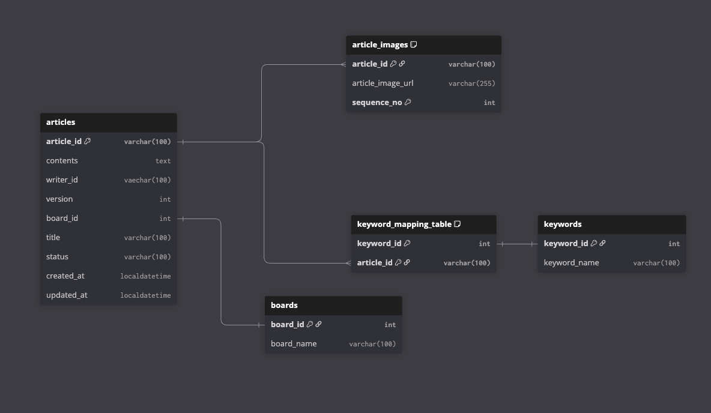
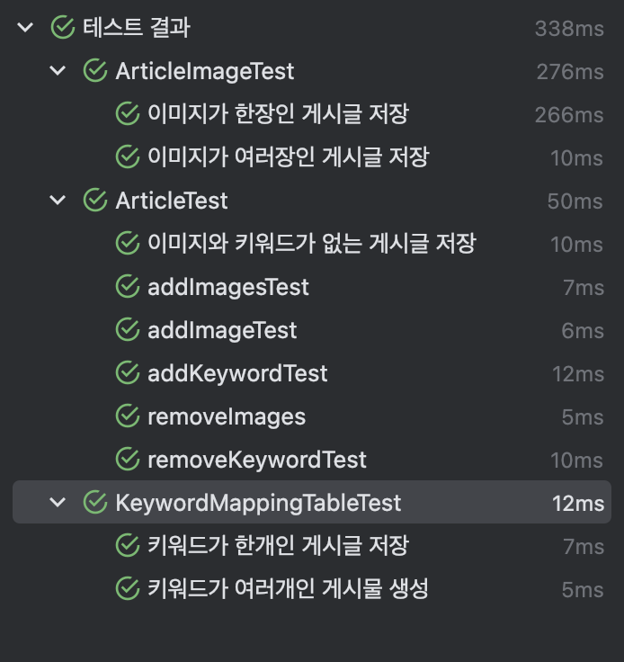
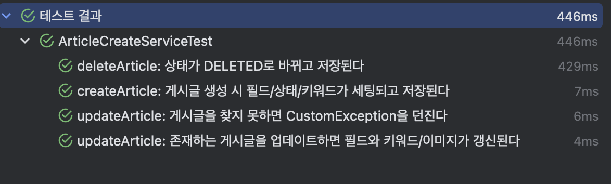
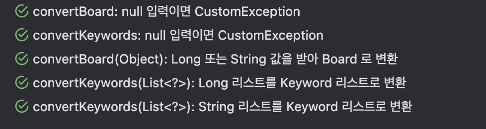

# 게시글 CRUD 서버 

----

## 디자인에 기반한 요구사항 정리

- [x] 프로필을 갖고있는 유저만 글을 작성 할 수 있다 .
- [x] 사전에 생성되어 있는 게시판에 글을 작성 할 수 있다.
- [x] 말머리 기능은 없다.
- [x] 게시글은 여렂장의 순서를 갖는 이미지를 입력 할 수 있다.
- [x] 작성자는 게시글을 수정 할 수 있으며, 이때 작성일자대신 수정일자가 나와야한다.
- [x] 게시글은 키워드, 글, 사진, 게시판, 카드용 썸네일이 있다.
- [x] 썸네일은 각 게시글의 첫장을 기준으로하며, 따로 지정하지는 않는다.

----

## 요구사항 기반 erd 초안 

----

## 외부 서버에서 받아오는 데이터 목록
- userId
- profileImageUrls

---

## TEST

